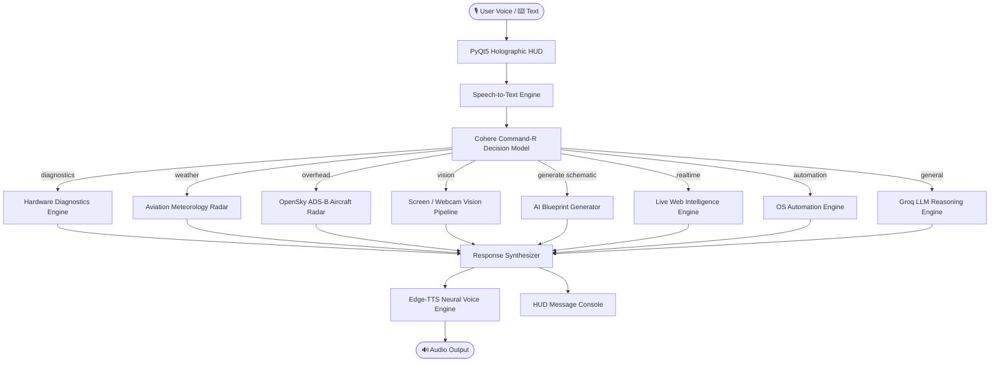

<div align="center">

# ⚡ J.A.R.V.I.S. — Autonomous AI Desktop Assistant

**Next-Gen Iron Man-Inspired AI Assistant with Real-Time Web Intelligence, Hardware Telemetry, Computer Vision & Sci-Fi HUD.**

[](https://www.python.org/)
[](https://pypi.org/project/PyQt5/)
[](https://groq.com/)
[](https://cohere.com/)
[](https://github.com/rany2/edge-tts)
[](LICENSE)
[](CONTRIBUTING.md)

[Features](#-key-features) • [Architecture](#-architecture) • [Getting Started](#-getting-started) • [Voice Commands](#-voice-command-cheat-sheet) • [Configuration](#-configuration)

</div>

---

## 📖 Overview

**J.A.R.V.I.S.** (*Just A Rather Very Intelligent System*) is a production-grade, voice-activated desktop artificial intelligence assistant designed to replicate the tactical capabilities of Tony Stark's iconic AI. 

Built natively in Python and PyQt5, JARVIS combines ultra-low-latency cloud LLMs (**Groq Qwen & LLaMA 3.3**, **Cohere Command-R**) with continuous hands-free voice recognition, live web intelligence, local computer vision, aerospace tracking, and system telemetry into a sleek, reactive holographic HUD.

---

## ✨ Key Features

### 🎙️ 1. Continuous Hands-Free Voice Control
* **Persistent Listening**: Toggle the microphone once and JARVIS continuously listens across multiple conversational turns without cutting out.
* **Refined British Voice**: Synthesizes speech using Microsoft Edge Neural TTS (`en-GB-RyanNeural`) delivering an authentic, low-latency British voice with 0% CPU strain and zero API costs.

### 🧠 2. Dual-Layer Decision Matrix Model (DMM)
* Routes prompts dynamically through **Cohere Command-R** to categorize user intent in milliseconds:
  * `general`: Conversational queries and direct knowledge.
  * `realtime`: Live web intelligence and current event searches.
  * `diagnostics`: System health and power core telemetry.
  * `overhead`: Aerospace transponder radar tracking.
  * `weather`: Aviation meteorology and flight conditions.
  * `vision`: Screen perception and camera analysis.
  * `generate schematic`: Architectural and engineering blueprint rendering.
  * `system / open / play`: Native operating system automation.

### 🌐 3. Live Web Intelligence & Fact-Checking
* Real-time search engine integration using **DuckDuckGo** and Google fallbacks.
* Automatically fetches live announcements, corporate events, medical/scientific discoveries, and breaking news, summarizing findings with high precision.

### 🛡️ 4. Suit Diagnostics & Hardware Telemetry
* Monitored via `psutil`:
  * Real-time CPU core workload percentages.
  * RAM consumption, committed memory, and buffer limits.
  * Primary storage health and volume utilization.
  * Power core battery metrics (charge percentage, AC vs. DC status).

### 🛰️ 5. Satellite & Overhead Aircraft Radar
* Queries live **OpenSky Network ADS-B transponder telemetry**.
* Scans a 100-kilometer radius around your location to report active aircraft, callsigns, altitudes, velocities, and bearing angles overhead.

### ⛈️ 6. Atmospheric & Flight Radar
* Connects to **Open-Meteo Aviation API** to report:
  * Ambient temperature and apparent wind chill.
  * Wind velocity and gusts at surface level.
  * Cloud ceiling, visibility distance, and flight safety clearances.

### 👁️ 7. "JARVIS Eyes" — Computer Vision
* **Screen Perception**: Seamlessly captures the active desktop display and inspects open windows, code, graphics, or errors via Groq Vision models.
* **Camera Perception**: Analyzes the physical environment via local webcam feeds.

### 📐 8. Instant AI Schematic & Blueprint Generation
* Synthesizes technical blueprints and engineering schematics of technological concepts, reactors, and circuits via Pollinations AI.

### ⚡ 9. Autonomous Desktop Automation
* Launches and manages desktop applications natively (`AppOpener`).
* Controls YouTube playback, Google queries, volume levels, and Windows processes.
* Generates written applications, emails, and scripts directly to Notepad.

---

## 🏗️ Architecture



---

## 🛠️ Tech Stack

| Component | Technology | Description |
| :--- | :--- | :--- |
| **GUI Framework** | PyQt5 | Custom dark-themed HUD with animated Arc Reactor GIF |
| **Decision Model** | Cohere `command-r-08-2024` | Intent routing and multi-action decomposition |
| **Reasoning LLM** | Groq (`qwen-2.5-32b` / `llama-3.3-70b`) | Ultra-fast contextual responses (< 500ms) |
| **Vision Model** | Groq `llama-3.2-11b-vision-preview` | Real-time screen and camera visual perception |
| **TTS Engine** | `edge-tts` (`en-GB-RyanNeural`) | Natural British neural voice synthesis |
| **STT Engine** | Web Speech API + Selenium | Hands-free continuous speech recognition |
| **Search Engine** | DuckDuckGo (`ddgs`) | Zero-cost live web intelligence |
| **Aviation Radar** | OpenSky Network REST API | Real-time ADS-B aircraft transponder feeds |
| **Telemetry** | `psutil` | OS-level hardware and battery performance metrics |

---

## 🚀 Getting Started

### 1. Prerequisites
* **Operating System**: Windows 10 or 11 (64-bit)
* **Python**: Python 3.10 to 3.13
* **Google Chrome**: Installed (used for headless speech recognition)
* **Microphone & Speakers**: Configured in Windows Settings

### 2. Clone the Repository
```bash
git clone https://github.com/your-username/jarvis-ai-assistant.git
cd jarvis-ai-assistant
```

### 3. Create a Virtual Environment
```powershell
python -m venv venv
.\venv\Scripts\Activate.ps1
```

### 4. Install Dependencies
```powershell
pip install -r requirements.txt
```

---

## 🔑 Configuration

1. Copy the `.env.example` file to create your `.env` configuration:
   ```powershell
   copy .env.example .env
   ```

2. Open `.env` in any text editor and fill in your free API keys:
   ```ini
   # Get free Cohere API Key from: https://dashboard.cohere.com/api-keys
   CohereAPIKey="your_cohere_api_key_here"

   # Get free Groq API Key from: https://console.groq.com/keys
   GroqAPIKey="your_groq_api_key_here"

   # Persona Settings
   Username="Sir"
   Assistantname="Jarvis"
   InputLanguage="en"
   AssistantVoice="en-GB-RyanNeural"
   ```

> [!NOTE]
> Both Groq and Cohere offer **generous, 100% free tiers**. You do not need to provide a credit card to run JARVIS.

---

## 🎮 Running JARVIS

Launch the assistant from PowerShell or Command Prompt:

```powershell
python Main.py
```

### Using the Interface:
1. **Activating the Microphone**: Click the **Microphone** icon on the bottom-left of the HUD. Once clicked, it will turn active and listen continuously.
2. **Holographic Mode**: Click the **Home** icon to view the pulsing Arc Reactor core and live status telemetry.
3. **Message Terminal**: Click the **Message** icon to view chat history and read written outputs.

---

## 🗣️ Voice Command Cheat Sheet

| Category | Example Voice Commands | Action Performed |
| :--- | :--- | :--- |
| **Diagnostics** | *"Check suit diagnostics and power core status."* | Reports CPU load, RAM usage, storage & battery. |
| **Flight Radar** | *"Jarvis, scan atmospheric and flight conditions."* | Analyzes local wind, visibility, pressure & safety. |
| **Overhead Radar** | *"Jarvis, overhead tracking report."* | Scans transponders for aircraft currently flying above. |
| **Live Web Intel** | *"Search the web for upcoming developer conferences."* | Performs live web search & summarizes top results. |
| **Fact-Checking** | *"Give me a tactical dossier on quantum computing."* | Synthesizes an intelligence briefing from verified sources. |
| **Computer Vision**| *"Jarvis, inspect my screen."* | Captures display and describes active window or bug. |
| **Schematics** | *"Generate a blueprint schematic of an arc reactor."* | Synthesizes and opens a technical schematic diagram. |
| **Desktop Control**| *"Open Chrome and launch Spotify."* | Autonomously opens applications on Windows. |
| **YouTube Playback**| *"Play AC/DC Back in Black on YouTube."* | Searches and launches the media directly in browser. |
| **Content Drafting**| *"Write a leave application and open it in Notepad."* | Generates document and opens in native Notepad editor. |

---

## 📂 Project Structure

```
Jarvis/
├── Backend/
│   ├── Automation.py          # OS controls, app opener, YouTube search
│   ├── Chatbot.py             # Groq LLM conversational reasoning
│   ├── ImageGeneration.py     # Schematic synthesis pipeline
│   ├── IronManFeatures.py     # Diagnostics, Radar, Weather, Vision & Dossier
│   ├── Model.py               # Cohere Command-R Decision Making Model (DMM)
│   ├── RealtimeSearchEngine.py# DuckDuckGo live intelligence engine
│   ├── SpeechToText.py        # Continuous headless browser speech recognition
│   └── TextToSpeech.py        # Edge-TTS British neural audio synthesizer
├── Frontend/
│   ├── Files/                 # Temporary IPC data pipes (Mic, Status, Chats)
│   ├── Graphics/              # HUD icons, buttons, and Arc Reactor animations
│   └── GUI.py                 # PyQt5 Holographic Window application
├── Data/                      # Local logs, cached audio, and generated schematics
├── .env.example               # Environment variable configuration template
├── .gitignore                 # Git ignore file protecting API keys & caches
├── requirements.txt           # Python dependency manifest
├── Main.py                    # Multi-threaded runtime entry point
└── README.md                  # Project documentation
```

---

## 🔒 Security & Privacy

* **Zero Hardcoded Secrets**: All authentication keys are managed through isolated `.env` configuration.
* **Ignored Data**: Temporary speech buffers, chat logs, and credentials are listed in `.gitignore` to prevent leaks.
* **Local Processing**: System diagnostics and screen captures are analyzed on-the-fly and never persisted to external third-party databases.

---

## 🤝 Contributing

Contributions, feature requests, and suggestions are welcome!
1. Fork the Project (`https://github.com/your-username/jarvis-ai-assistant/fork`)
2. Create your Feature Branch (`git checkout -b feature/StarkFeature`)
3. Commit your Changes (`git commit -m 'Add StarkFeature'`)
4. Push to the Branch (`git push origin feature/StarkFeature`)
5. Open a Pull Request

---

## 📜 License

Distributed under the **MIT License**. See `LICENSE` for more information.

---

## ⚠️ Disclaimer

*J.A.R.V.I.S. is an open-source fan and research project inspired by Marvel's Iron Man. It is not affiliated with, endorsed by, or associated with Marvel Entertainment or The Walt Disney Company.*
